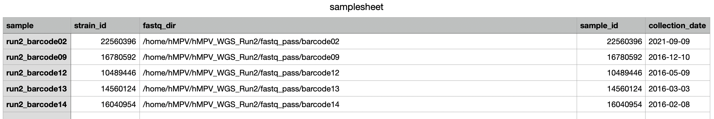
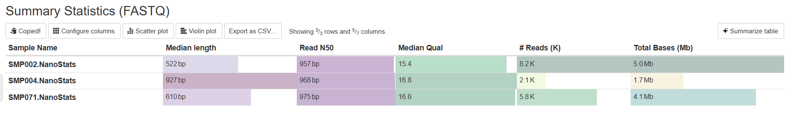
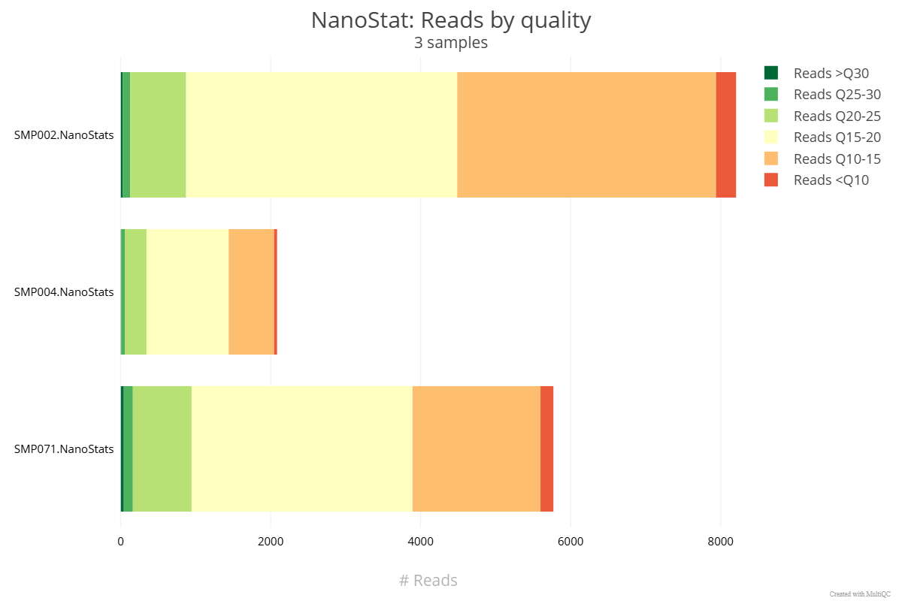
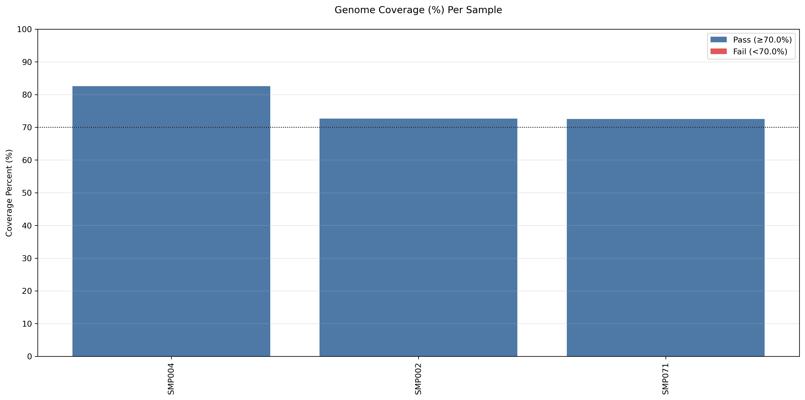
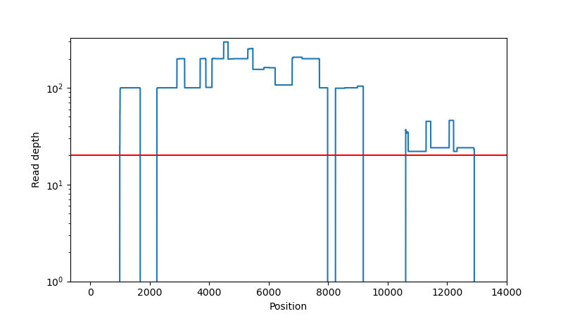
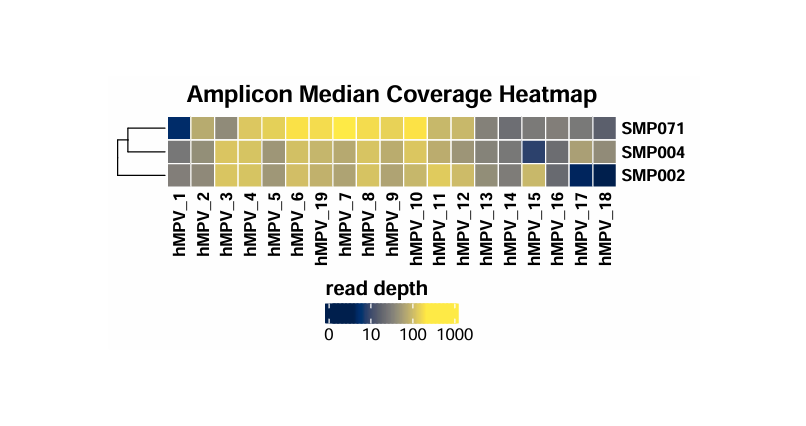
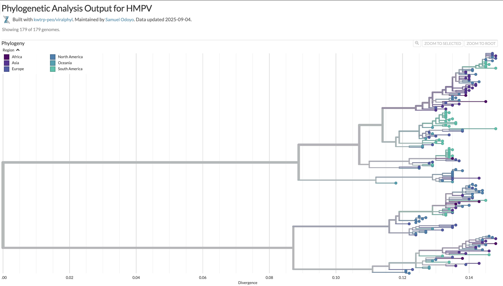
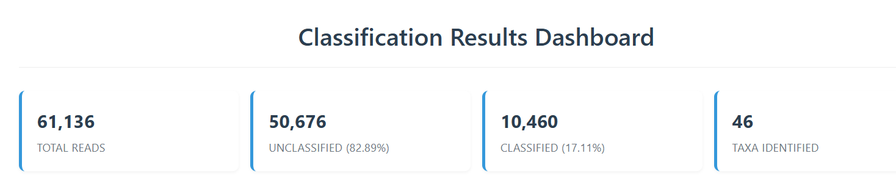
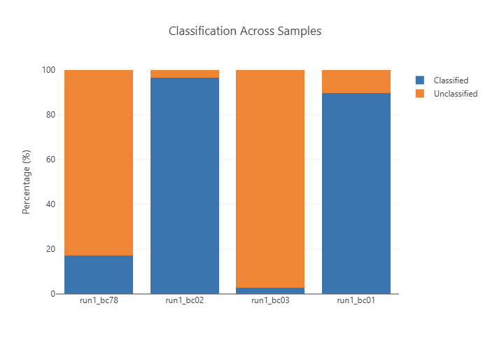
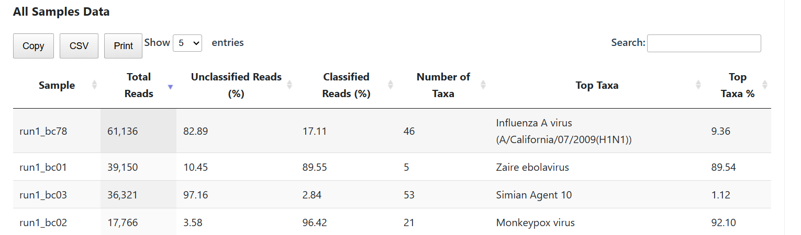

# Viralphyl: Output
This documentation provides an overview of the output of the pipeline, at different stages and how to interprete these results 

All the directories and output files generated during the pipeline execution will be located in the results folder. 

The directories and subdirectories listed correspond to the various steps and stages of the pipeline


# Amplicon: Pipeline overview  
- [Preprocessing](#amplicon-preprocessing) 
  -  [custom python script](#amplicon-sample-sheet) - sample sheet and metadata 
    -  [NanoPlot](#amplicon-nanoplot) Sequencing QC 
    -  [artic guppyplex](#amplicon-artic-guppyplex) - Filter and aggregate demultiplexed reads from MinKNOW/Guppy
 
- [Whole genome assembly](#amplicon-whole-genome-assembly--variant-calling)
  -  [artic minion](#amplicon-artic-minion) - Align reads, call variants, and produce a consensus sequence 
  -  [mosdepth](#amplicon-mosdepth) - Genome-wide and amplicon coverage QC plots
- [Phylogenetics](#amplicon-phylogenetics)
  -  [mafft](#amplicon-mafft)  Global sequence alignment
  -  [fasttree](#amplicon-fasttree) - Generate global phylogenetic trees using maximum likelihood method 
  
  -  [augur](#amplicon-augur) - Refine global phylogeny and create a JSON file  
  -  [auspice](#amplicon-auspice) - Display global phylogenetic tree interactively 

## Amplicon: Preprocessing 
At the first stage of the pipeline,  a sample sheet is created from the input files provided and the reads are demultiplexed.  

### Amplicon: Sample sheet 
A sample sheet automatically is prepared using a custom script. This helps process multiple samples as one




### Amplicon: artic guppyplex
The [artic guppyplex]() is a tool from the [ARTIC field bioinformatics pipeline](https://github.com/artic-network/fieldbioinformatics), used to demultiplex reads from MinKNOW/Guppy. This process filters and subsamples the reads to the required size range of the amplicons, depending on the primers used. 
The parametes for the minimum and maximum lenth can be adjusted using ```--min_read_length``` and ```--max_read_length``` respectifully 

<details>
<summary>Output Files </summary>

```guppyplex_out``` /
- ``` *.fastq```  files containing the filtered FASTQ(s)

</details>

### Amplicon: NanoPlot

[NanoPlot](https://github.com/wdecoster/NanoPlot) computes and calculates the read length distribution, quality, and sequencing performance of the data. The nanostat data is computed and summarized in a multiqc ```html``` file 

<details>
<summary>Output Files </summary>

```NanoPlot``` /
- ``` *.html``` and ```.tsv``` files contain the QC plots showing the read length 

</details>






## Amplicon: Whole Genome Assembly & Variant Calling

### Amplicon: artic minion

The [artic minion]() is a tool from the [ARTIC field bioinformatics pipeline](https://github.com/artic-network/fieldbioinformatics), used to filter, trim, align the reads, call variants and produce a consesus sequence.

### Amplicon: Mosdepth 
[Mosdepth](https://github.com/brentp/mosdepth) calculates the depth coverage, and gives the amplicon coverage QC plots. 








## Amplicon: Phylogenetics 
The pipeline allows you to perform phylogenetic analysis, giving the option to download global dataset and the corresponding metadata if not provided. 

### Amplicon: Mafft
[Mafft](https://github.com/GSLBiotech/mafft) performs global sequence alignment, using the dataset provided and outputs and aligned fasta file. 

<details>
<summary>Output Files </summary>

```Mafft``` /
- ``` *.fasta``` files that contain the aligned sequences

</details>
 
### Amplicon: Fasttree

[Fasttree](https://github.com/morgannprice/fasttree) is a phylogenetic tree building tool that utilizes the aligned sequences (from mafft) to construct a maximum likelihood phylogenetic tree. 

The output is a phylogenetic tree in **Newick** format

<details>
<summary>Output Files </summary>

```tree``` /
- ``` *.nwk``` a newick tree file

</details>


### Amplicon: Augur 

[Augur](https://github.com/nextstrain/augur) refines the global phylogeny and creates a JSON file for visualization

 <details>
<summary>Output Files </summary>

```Augur``` /
- ``` auspice.json``` a combined output for auspice visualizing

</details>


### Amplicon: Auspice

[Auspice](https://github.com/nextstrain/auspice) displays the generated global phylogenetic tree interactively with metadata integration




# Metagenomics: Pipeline Overview

- [Prepocessing](#metagenomics-prepocessing)
  - [Custom python script](#amplicon-sample-sheet) - Sample sheet and metadata prep
  - [Nanoplot](#metagenomics-nanoplot) - Sequencing QC 
- [Raw read classification](#metagenomics-raw-read-classification)
  - [porechop_abi](#metagenomics-porechop_abi) - Adapter trimming
  - [minimap2 and samtools](#metagenomics-minimap2-and-samtools)- Host (Human) reads removal
- [Taxonomic Classification](#metagenomics-taxonomic-classification)
  - [mash or kraken2](#metagenomics-mashkraken)- Taxonomic classification
  - [Custom python script](#metagenomics-taxonomic-classification) - Classification report generation

- [Read assembly Extraction of classified reads](#metagenomics-read-assembly-extraction)- (Custom bash script)
 
  1. Reference Based
    - [efetch]() - Reference download
    - [minimap2 and samtools]() - Consesus generation


## Metagenomics: Prepocessing 

### Metagenomics: Sample Sheet 
All samples are compiled into a single sample sheet using a python custom script. The sample sheet is used as the input for the next step. 

### Metagenomics: Nanoplot 

[NanoPlot](https://github.com/wdecoster/NanoPlot) computes and calculates the read length distribution, quality, and sequencing performance of the data. The nanostat data is computed and summarized in a multiqc ```html``` file 

## Metagenomics: Raw Read Classification

### Metagenomics: porechop_abi

[porechop_abi](https://github.com/bonsai-team/Porechop_ABI) is a tool used to remove adapter ends in OONT reads, yielding cleaned fasta/fastq reads 

### Metagenomics: minimap2 and samtools

[Minimap2](https://github.com/lh3/minimap2) indexes the host genome and aligns the reads to the host genome. [Samtools]() is then used to sort and extract non-host reads for further processing. 

## Metagenomics: Taxonomic Classification 

### Metagenomics: Mash/Kraken
[Mash](https://github.com/marbl/Mash) and [kraken](https://github.com/DerrickWood/kraken2) provide taxonomic classification of the metagenomic reads, using databases. The obtained outputs can be visualized in summary outputs 





## Metagenomics: Read Assembly Extraction


### Metagenomics: efetch
[epost utilities](https://github.com/maurermj08/efetch) is a NCBI utility used in downloading reference sequence for genome assembly


### Metagenomics: minimap2 and samtools
[Minimap](https://github.com/lh3/minimap2) and [Samtools](https://github.com/samtools/samtools) are used to generate a consensus genome from the generated assemblies 